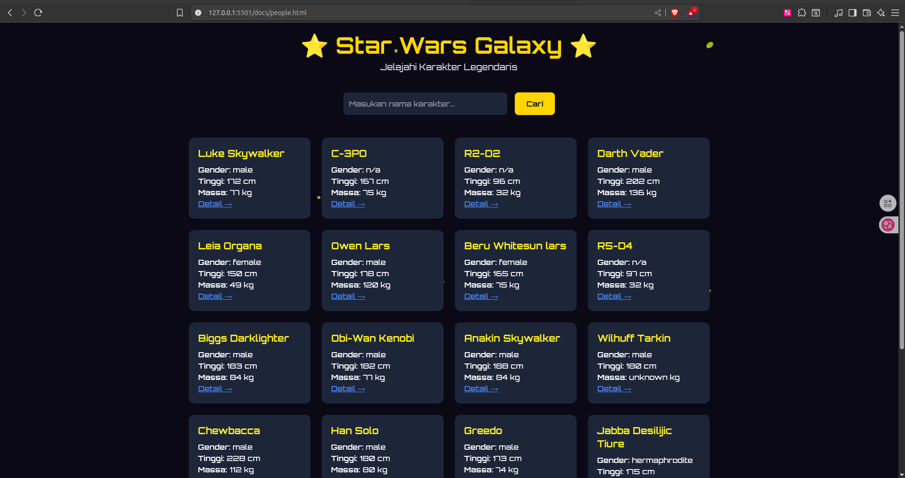

# 🌌 Star Wars Explorer

> **Website interaktif** untuk mengeksplorasi data **Star Wars Universe** seperti **Planets** dan **Characters (People)** melalui **API SWAPI**.  
> Dibangun dengan **HTML**, **Tailwind CSS**, dan **JavaScript**.

---

## ✨ Fitur Utama

- 🌍 **Cari Planet** – Masukkan ID planet dan tampilkan detail lengkap (nama, diameter, rotasi, dll).
- 🧑‍🚀 **Cari Karakter** – Cari karakter berdasarkan **ID** atau **Nama**.
- 🔗 **Tautan Langsung API** – Setiap data memiliki URL API yang bisa diakses.
- 🎨 **UI Modern & Interaktif** – Menggunakan **TailwindCSS** dengan sentuhan tema **Star Wars**.
- 📱 **Responsive** – Cocok di desktop maupun mobile.
- ⚡ **Animasi & Icon 3D** – Menambah nuansa futuristik khas galaksi Star Wars.

---

## 📸 Screenshot
#### Preview Karakter StarWars
> 
#### Preview PLanets StarWars
> 

---

## 🛠 Teknologi yang Digunakan


---

## 🚀 Cara Menjalankan

1. Clone repository ini:

```bash
git clone https://github.com/itszarmaull/projekStarwars.git

```

2. Masuk ke folder project:

```bash
cd projekStarwars
```

3. Buka file index.html di browser favorit kamu.

4. 📂 Struktur Folder

```bash
    📦 projekStarwars
  ┣ 📂 docs/            # File utama untuk GitHub Pages
  ┃ ┣ 📂 css/           # File Tailwind output.css
  ┃ ┣ 📂 js/            # File JavaScript (logic API)
  ┃ ┣ 📜 index.html     # Halaman utama (informasi project)
  ┃ ┣ 📜 people.html    # Cari karakter Star Wars
  ┃ ┗ 📜 planet.html    # Cari planet Star Wars
  ┣ 📜 package.json
  ┣ 📜 package-lock.json
  ┣ 📜 .gitignore
  ┗ 📜 README.md
```

## 🌐 Next Project

```bash

💡 Ide Pengembangan Selanjutnya

🔎 Fitur pencarian starships dan vehicles.

🎬 Tambah gambar/ilustrasi karakter dan planet.

📊 Mode galaxy explorer untuk menampilkan semua data dalam tabel.

🌐 Integrasi dengan API Star Wars Fan Art agar lebih menarik.

```

### 👨‍💻 Kontribusi

```yaml
Pull Request terbuka untuk ide baru atau perbaikan bug.
Jangan lupa ⭐ repository ini jika kamu merasa bermanfaat!⚖️ Lisensi

© Fazar Maulana 2025 – Dibuat dengan semangat secukupnya & kopi Kenganan awokwok
```
